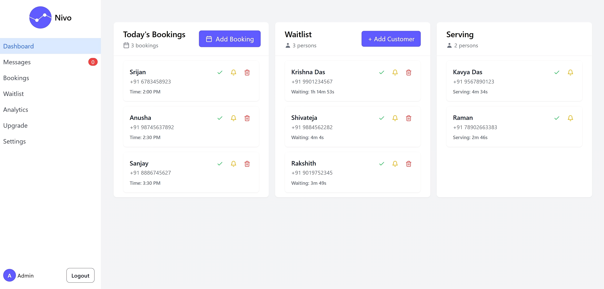

# Nivo - Customer experience software



[](https://opensource.org/licenses/MIT)
[](https://nodejs.org/)
[](https://reactjs.org/)

Nivo is a customer experience software that helps businesses manage customer flow and reduce waiting times.

## 🚀 Features

### Core Functionality
- **Real-time Queue Management** - Live updates using Socket.io for instant synchronization
- **Smart Appointment Scheduling** - Advanced booking system with time slot management
- **Customer Self-Service** - QR code-based self-registration and check-in
- **Multi-Channel Support** - Web dashboard and customer-facing interfaces
- **Business Analytics** - Comprehensive insights into queue performance and customer behavior

### Technical Features
- **Responsive Design** - Works seamlessly across desktop, tablet, and mobile devices
- **Multi-tenant Architecture** - Support for multiple businesses with isolated data
- **RESTful API** - Well-documented API for integrations and extensions
- **Security First** - JWT authentication, password hashing, and data validation

## 🛠️ Tech Stack

### Frontend
- **React 18** - Modern React with hooks and concurrent features
- **TypeScript** - Type-safe development experience
- **Vite** - Lightning-fast build tool and dev server
- **Tailwind CSS** - Utility-first CSS framework
- **Shadcn/ui** - High-quality, accessible UI components
- **TanStack Query** - Powerful data fetching and caching
- **Chart.js** - Interactive analytics and data visualization

### Backend
- **Node.js** - JavaScript runtime environment
- **Express.js** - Fast, minimalist web framework
- **MongoDB** - NoSQL database for flexible data storage
- **Mongoose** - Elegant MongoDB object modeling
- **Zod** - TypeScript-first schema validation

## 📋 Prerequisites

Before you begin, ensure you have the following installed:

- **Node.js** (v18.0.0 or higher)
- **npm** or **yarn** or **bun** (recommended)
- **MongoDB** (v5.0 or higher)
- **Git**

## 🚀 Quick Start

### 1. Clone the Repository

```bash
git clone https://github.com/yourusername/nivo.git
cd nivo
```

### 2. Backend Setup

```bash
cd backend

# Install dependencies
npm install

# Create environment file
cp .env.example .env

# Configure your environment variables
# Edit .env with your MongoDB connection string and other settings

# Start the backend server
npm run dev
```

### 3. Frontend Setup

```bash
cd frontend

# Install dependencies
npm install

# Start the development server
npm run dev
```

### 4. Database Setup

Make sure MongoDB is running on your system. The application will automatically create the necessary collections on first run.

Default connection: `mongodb://localhost:27017/testv1`

## 📝 Environment Variables

Create a `.env` file in the backend directory:

```env
# Database
MONGODB_URI=mongodb://localhost:27017/testv1

# JWT
JWT_SECRET=your-secret-key-here
JWT_EXPIRES_IN=7d

# Server
PORT=5000
NODE_ENV=development

# CORS
FRONTEND_URL=http://localhost:5173
```

## 🏗️ Project Structure

```
nivo/
├── frontend/                 # React frontend application
│   ├── src/
│   │   ├── components/      # Reusable UI components
│   │   ├── pages/          # Page components
│   │   ├── hooks/          # Custom React hooks
│   │   ├── utils/          # Utility functions
│   │   └── assets/         # Static assets
│   ├── public/             # Public assets
│   └── package.json        # Frontend dependencies
│
├── backend/                 # Node.js backend application
│   ├── routes/             # API routes
│   │   ├── user.js         # User management routes
│   │   ├── appointment.js  # Appointment routes
│   │   └── queue.js        # Queue management routes
│   ├── middleware/         # Express middleware
│   ├── utils/              # Backend utilities
│   ├── db.js              # Database models and connection
│   ├── index.js           # Main server file
│   └── package.json       # Backend dependencies
│
└── README.md              # This file
```

## 📖 API Documentation

Base URL: `/api/v1`

### Authentication Endpoints

```http
POST /api/v1/user/signup        # Register new business
POST /api/v1/user/login         # Login user
GET  /api/v1/user/profile       # Get current user profile
GET  /api/v1/user/patient-stats # Get patient statistics
PUT  /api/v1/user/business-hours # Update business hours
```

### Queue Management

```http
GET    /api/v1/queue/waitlist       # Get current waitlist
GET    /api/v1/queue/serving        # Get currently serving patients
POST   /api/v1/queue/patient        # Add patient to queue (authenticated)
POST   /api/v1/queue/customeradd/:userId # Add customer to specific user's queue (public)
PUT    /api/v1/queue/patient/:id/serve    # Move patient from waiting to serving
PUT    /api/v1/queue/patient/:id/complete # Complete patient consultation
GET    /api/v1/queue/patient/:id    # Get patient details
GET    /api/v1/queue/allpatient     # Get all patients
```

### Appointments

```http
GET    /api/v1/appointment/available-slots/:userId/:date # Get available time slots
POST   /api/v1/appointment/book/:userId                  # Book appointment (public)
POST   /api/v1/appointment/add-booking                   # Add booking (authenticated)
GET    /api/v1/appointment/user-appointments             # Get user's appointments
GET    /api/v1/appointment/today-bookings                # Get today's bookings
PUT    /api/v1/appointment/cancel/:appointmentId         # Cancel appointment
```

### Business Management

```http
GET    /api/v1/user/queue-status/:userId           # Get queue status for specific user
GET    /api/v1/user/businessName/:userId           # Get business name by user ID
GET    /api/v1/user/get-user-by-business/:businessNameForUrl # Get user by business URL
```

---

**Made with ❤️ for efficient business management**
